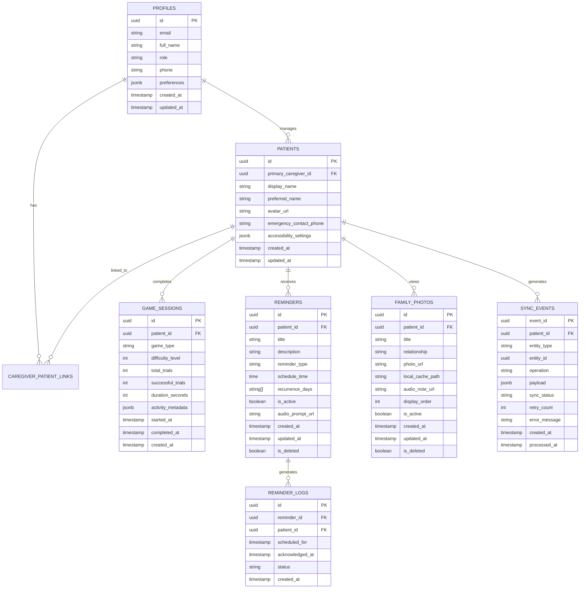

# NIRVANA - Database & Persistence Specification

## 1. Overview & Dual-Persistence Architecture

NIRVANA utilizes a dual-tier persistence model:
1. **Local Tier (Hive)**: Fast, synchronous NoSQL key-value & binary object storage embedded in the Flutter app. Acts as the Single Source of Truth (SSOT) for the UI.
2. **Cloud Tier (Supabase PostgreSQL)**: Relational database with strict Row Level Security (RLS) policies, providing asynchronous backup, cross-device sync, and caregiver dashboard aggregation.



---

## 2. Supabase PostgreSQL Schema (DDL)

```sql
-- Enable UUID generation extension
CREATE EXTENSION IF NOT EXISTS "uuid-ossp";

-- 1. Profiles Table (Caregivers & Administrators)
CREATE TABLE IF NOT EXISTS public.profiles (
    id UUID PRIMARY KEY REFERENCES auth.users(id) ON DELETE CASCADE,
    email TEXT UNIQUE NOT NULL,
    full_name TEXT NOT NULL,
    role TEXT NOT NULL CHECK (role IN ('caregiver', 'family_member', 'admin')),
    phone TEXT,
    preferences JSONB DEFAULT '{"theme": "system", "notifications_enabled": true}'::jsonb,
    created_at TIMESTAMPTZ DEFAULT TIMEZONE('utc', NOW()) NOT NULL,
    updated_at TIMESTAMPTZ DEFAULT TIMEZONE('utc', NOW()) NOT NULL
);

-- 2. Patients Table (Elderly User Profile)
CREATE TABLE IF NOT EXISTS public.patients (
    id UUID PRIMARY KEY DEFAULT uuid_generate_v4(),
    primary_caregiver_id UUID REFERENCES public.profiles(id) ON DELETE SET NULL,
    display_name TEXT NOT NULL,
    preferred_name TEXT NOT NULL,
    avatar_url TEXT,
    emergency_contact_phone TEXT,
    accessibility_settings JSONB DEFAULT '{
        "large_text": true,
        "high_contrast": true,
        "audio_prompts": true,
        "haptic_feedback": true,
        "low_motion": true
    }'::jsonb NOT NULL,
    created_at TIMESTAMPTZ DEFAULT TIMEZONE('utc', NOW()) NOT NULL,
    updated_at TIMESTAMPTZ DEFAULT TIMEZONE('utc', NOW()) NOT NULL
);

-- 3. Caregiver to Patient Association (Multi-caregiver access)
CREATE TABLE IF NOT EXISTS public.caregiver_patient_links (
    id UUID PRIMARY KEY DEFAULT uuid_generate_v4(),
    caregiver_id UUID NOT NULL REFERENCES public.profiles(id) ON DELETE CASCADE,
    patient_id UUID NOT NULL REFERENCES public.patients(id) ON DELETE CASCADE,
    relationship_label TEXT DEFAULT 'Caregiver',
    access_role TEXT NOT NULL CHECK (access_role IN ('primary', 'secondary', 'viewer')),
    created_at TIMESTAMPTZ DEFAULT TIMEZONE('utc', NOW()) NOT NULL,
    UNIQUE(caregiver_id, patient_id)
);

-- 4. Game Sessions (Activity Logs - strictly non-clinical)
CREATE TABLE IF NOT EXISTS public.game_sessions (
    id UUID PRIMARY KEY DEFAULT uuid_generate_v4(),
    patient_id UUID NOT NULL REFERENCES public.patients(id) ON DELETE CASCADE,
    game_type TEXT NOT NULL CHECK (game_type IN ('remember_objects', 'who_is_this', 'grocery_memory')),
    difficulty_level INT NOT NULL DEFAULT 1,
    total_trials INT NOT NULL DEFAULT 0,
    successful_trials INT NOT NULL DEFAULT 0,
    duration_seconds INT NOT NULL DEFAULT 0,
    activity_metadata JSONB DEFAULT '{}'::jsonb,
    started_at TIMESTAMPTZ NOT NULL,
    completed_at TIMESTAMPTZ NOT NULL,
    created_at TIMESTAMPTZ DEFAULT TIMEZONE('utc', NOW()) NOT NULL
);

-- 5. Reminders Table
CREATE TABLE IF NOT EXISTS public.reminders (
    id UUID PRIMARY KEY DEFAULT uuid_generate_v4(),
    patient_id UUID NOT NULL REFERENCES public.patients(id) ON DELETE CASCADE,
    title TEXT NOT NULL,
    description TEXT,
    reminder_type TEXT NOT NULL CHECK (reminder_type IN ('medication', 'hydration', 'meal', 'social', 'activity', 'general')),
    schedule_time TIME NOT NULL,
    recurrence_days TEXT[] DEFAULT ARRAY['mon','tue','wed','thu','fri','sat','sun'],
    is_active BOOLEAN DEFAULT true NOT NULL,
    audio_prompt_url TEXT,
    is_deleted BOOLEAN DEFAULT false NOT NULL,
    created_at TIMESTAMPTZ DEFAULT TIMEZONE('utc', NOW()) NOT NULL,
    updated_at TIMESTAMPTZ DEFAULT TIMEZONE('utc', NOW()) NOT NULL
);

-- 6. Reminder Logs Table (Tracking acknowledgement)
CREATE TABLE IF NOT EXISTS public.reminder_logs (
    id UUID PRIMARY KEY DEFAULT uuid_generate_v4(),
    reminder_id UUID NOT NULL REFERENCES public.reminders(id) ON DELETE CASCADE,
    patient_id UUID NOT NULL REFERENCES public.patients(id) ON DELETE CASCADE,
    scheduled_for TIMESTAMPTZ NOT NULL,
    acknowledged_at TIMESTAMPTZ,
    status TEXT NOT NULL CHECK (status IN ('acknowledged', 'missed', 'snoozed')),
    created_at TIMESTAMPTZ DEFAULT TIMEZONE('utc', NOW()) NOT NULL
);

-- 7. Family Photos Table
CREATE TABLE IF NOT EXISTS public.family_photos (
    id UUID PRIMARY KEY DEFAULT uuid_generate_v4(),
    patient_id UUID NOT NULL REFERENCES public.patients(id) ON DELETE CASCADE,
    title TEXT NOT NULL,
    relationship TEXT NOT NULL,
    photo_url TEXT NOT NULL,
    audio_note_url TEXT,
    display_order INT DEFAULT 0 NOT NULL,
    is_active BOOLEAN DEFAULT true NOT NULL,
    is_deleted BOOLEAN DEFAULT false NOT NULL,
    created_at TIMESTAMPTZ DEFAULT TIMEZONE('utc', NOW()) NOT NULL,
    updated_at TIMESTAMPTZ DEFAULT TIMEZONE('utc', NOW()) NOT NULL
);

-- 8. Sync Events Table (Server Idempotency Journal)
CREATE TABLE IF NOT EXISTS public.sync_events (
    event_id UUID PRIMARY KEY,
    patient_id UUID NOT NULL REFERENCES public.patients(id) ON DELETE CASCADE,
    entity_type TEXT NOT NULL,
    entity_id UUID NOT NULL,
    operation TEXT NOT NULL CHECK (operation IN ('INSERT', 'UPDATE', 'DELETE')),
    payload JSONB NOT NULL,
    sync_status TEXT NOT NULL DEFAULT 'PROCESSED' CHECK (sync_status IN ('PROCESSED', 'FAILED', 'IGNORED')),
    retry_count INT DEFAULT 0 NOT NULL,
    error_message TEXT,
    created_at TIMESTAMPTZ NOT NULL,
    processed_at TIMESTAMPTZ DEFAULT TIMEZONE('utc', NOW()) NOT NULL
);

-- Indexes for high-frequency queries
CREATE INDEX IF NOT EXISTS idx_game_sessions_patient ON public.game_sessions(patient_id, created_at DESC);
CREATE INDEX IF NOT EXISTS idx_reminders_patient ON public.reminders(patient_id) WHERE is_deleted = false;
CREATE INDEX IF NOT EXISTS idx_reminder_logs_patient ON public.reminder_logs(patient_id, scheduled_for DESC);
CREATE INDEX IF NOT EXISTS idx_family_photos_patient ON public.family_photos(patient_id, display_order ASC) WHERE is_deleted = false;
CREATE INDEX IF NOT EXISTS idx_sync_events_patient ON public.sync_events(patient_id, created_at DESC);
```

---

## 3. Row Level Security (RLS) Policies

```sql
-- Enable RLS on all tables
ALTER TABLE public.profiles ENABLE ROW LEVEL SECURITY;
ALTER TABLE public.patients ENABLE ROW LEVEL SECURITY;
ALTER TABLE public.caregiver_patient_links ENABLE ROW LEVEL SECURITY;
ALTER TABLE public.game_sessions ENABLE ROW LEVEL SECURITY;
ALTER TABLE public.reminders ENABLE ROW LEVEL SECURITY;
ALTER TABLE public.reminder_logs ENABLE ROW LEVEL SECURITY;
ALTER TABLE public.family_photos ENABLE ROW LEVEL SECURITY;
ALTER TABLE public.sync_events ENABLE ROW LEVEL SECURITY;

-- Helper security function: Check if authenticated user is linked to patient
CREATE OR REPLACE FUNCTION public.is_caregiver_for_patient(patient_uuid UUID)
RETURNS BOOLEAN AS $$
BEGIN
    RETURN EXISTS (
        SELECT 1 FROM public.caregiver_patient_links
        WHERE caregiver_id = auth.uid()
        AND patient_id = patient_uuid
    ) OR EXISTS (
        SELECT 1 FROM public.patients
        WHERE id = patient_uuid
        AND primary_caregiver_id = auth.uid()
    );
END;
$$ LANGUAGE plpgsql SECURITY DEFINER;

-- Profiles Policies
CREATE POLICY "Users can view and edit own profile"
    ON public.profiles FOR ALL
    USING (auth.uid() = id);

-- Patients Policies
CREATE POLICY "Caregivers can view linked patients"
    ON public.patients FOR SELECT
    USING (public.is_caregiver_for_patient(id));

CREATE POLICY "Caregivers can update linked patients"
    ON public.patients FOR UPDATE
    USING (public.is_caregiver_for_patient(id));

-- Game Sessions Policies
CREATE POLICY "Caregivers can view patient game sessions"
    ON public.game_sessions FOR SELECT
    USING (public.is_caregiver_for_patient(patient_id));

CREATE POLICY "Caregivers or patient client can insert game sessions"
    ON public.game_sessions FOR INSERT
    WITH CHECK (public.is_caregiver_for_patient(patient_id));

-- Reminders & Family Photos Policies
CREATE POLICY "Caregiver manage reminders"
    ON public.reminders FOR ALL
    USING (public.is_caregiver_for_patient(patient_id));

CREATE POLICY "Caregiver manage reminder logs"
    ON public.reminder_logs FOR ALL
    USING (public.is_caregiver_for_patient(patient_id));

CREATE POLICY "Caregiver manage family photos"
    ON public.family_photos FOR ALL
    USING (public.is_caregiver_for_patient(patient_id));

CREATE POLICY "Caregiver manage sync events"
    ON public.sync_events FOR ALL
    USING (public.is_caregiver_for_patient(patient_id));
```

---

## 4. Local Persistence Schema (Hive)

Hive uses isolated boxes mapping to typed domain models:

| Hive Box Name | Model Type / Adapter ID | Key Format | Description |
|---|---|---|---|
| `box_profile` | `ProfileEntity` (ID: 0) | `current_user_profile` | Current elder profile / active settings |
| `box_game_sessions` | `GameSessionEntity` (ID: 1) | UUID string (`id`) | All local game engagement sessions |
| `box_reminders` | `ReminderEntity` (ID: 2) | UUID string (`id`) | Daily and medication reminder definitions |
| `box_reminder_logs` | `ReminderLogEntity` (ID: 3) | UUID string (`id`) | Logged acknowledgements & completed reminders |
| `box_family_photos` | `FamilyPhotoEntity` (ID: 4) | UUID string (`id`) | Family photo records & cached media paths |
| `box_sync_events` | `SyncEventEntity` (ID: 5) | UUID string (`event_id`) | Local queue of mutations waiting for upload |
| `box_app_settings` | Key-value raw maps | Setting keys | Language, theme, motion, volume, dev flags |
