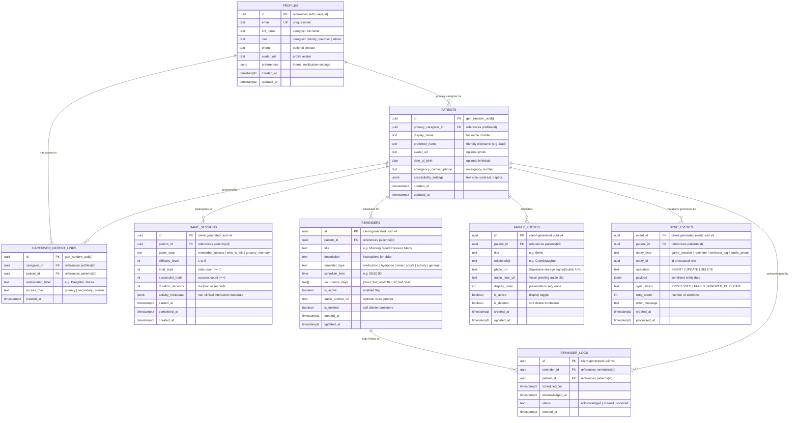

# NIRVANA - Comprehensive Database & Backend Architecture Documentation

## 1. Overview & Architectural Principles

The NIRVANA backend runs on **Supabase PostgreSQL** and is architected specifically to support an **offline-first** Flutter application.

### Key Backend Rules:
1. **Zero Service-Role Keys in Flutter**: The Flutter application only uses the Supabase public `anon` key and user authentication JWTs. All authorization and isolation are handled strictly at the database layer via **Row Level Security (RLS)**.
2. **Idempotent Synchronization**: The `sync_events` journal guarantees that retransmitted network events (due to client timeouts or reconnections) execute exactly once without producing duplicate records.
3. **Non-Clinical Activity Telemetry**: Data collected from games consists solely of participation metrics (consistency, trials completed, duration, preferred activities), strictly devoid of diagnostic or clinical assessments.
4. **Soft Deletions**: Entities that can be deleted by caregivers (such as reminders or family photos) use `is_deleted = true` tombstones with `updated_at` timestamps to avoid resurrecting records across distributed offline devices.

---

## 2. Entity Relationship Diagram



---

## 3. Database Tables & Column Specifications

### 3.1 `public.profiles`
Stores caregiver, family member, and administrator details linked directly to Supabase Auth.
- `id` (`UUID`, Primary Key, `REFERENCES auth.users(id) ON DELETE CASCADE`)
- `email` (`TEXT`, Unique, Not Null)
- `full_name` (`TEXT`, Not Null)
- `role` (`TEXT`, Not Null, `CHECK (role IN ('caregiver', 'family_member', 'admin'))`)
- `phone` (`TEXT`, Nullable)
- `avatar_url` (`TEXT`, Nullable)
- `preferences` (`JSONB`, Not Null, Default `{"theme": "system", "notifications_enabled": true}`)
- `created_at` (`TIMESTAMPTZ`, Not Null, Default `TIMEZONE('utc', NOW())`)
- `updated_at` (`TIMESTAMPTZ`, Not Null, Auto-updated via trigger)

### 3.2 `public.patients`
Stores elder/care recipient profiles and their accessible UI settings.
- `id` (`UUID`, Primary Key, Default `gen_random_uuid()`)
- `primary_caregiver_id` (`UUID`, `REFERENCES public.profiles(id) ON DELETE SET NULL`)
- `display_name` (`TEXT`, Not Null)
- `preferred_name` (`TEXT`, Not Null, e.g. "Dad", "Grandma")
- `avatar_url` (`TEXT`, Nullable)
- `date_of_birth` (`DATE`, Nullable)
- `emergency_contact_phone` (`TEXT`, Nullable)
- `accessibility_settings` (`JSONB`, Not Null, Default high-contrast / large-text config)
- `created_at` (`TIMESTAMPTZ`, Not Null)
- `updated_at` (`TIMESTAMPTZ`, Not Null, Auto-updated via trigger)

### 3.3 `public.caregiver_patient_links`
Enables multiple family members or professional caregivers to access a patient's activities with designated permissions.
- `id` (`UUID`, Primary Key, Default `gen_random_uuid()`)
- `caregiver_id` (`UUID`, Not Null, `REFERENCES public.profiles(id) ON DELETE CASCADE`)
- `patient_id` (`UUID`, Not Null, `REFERENCES public.patients(id) ON DELETE CASCADE`)
- `relationship_label` (`TEXT`, Not Null, Default 'Caregiver')
- `access_role` (`TEXT`, Not Null, `CHECK (access_role IN ('primary', 'secondary', 'viewer'))`)
- `created_at` (`TIMESTAMPTZ`, Not Null)
- **Constraint**: `UNIQUE(caregiver_id, patient_id)`

### 3.4 `public.game_sessions`
Append-only log of cognitive engagement activity sessions.
- `id` (`UUID`, Primary Key)
- `patient_id` (`UUID`, Not Null, `REFERENCES public.patients(id) ON DELETE CASCADE`)
- `game_type` (`TEXT`, Not Null, `CHECK (game_type IN ('remember_objects', 'who_is_this', 'grocery_memory'))`)
- `difficulty_level` (`INT`, Not Null, Default 1, `CHECK (difficulty_level BETWEEN 1 AND 5)`)
- `total_trials` (`INT`, Not Null, Default 0)
- `successful_trials` (`INT`, Not Null, Default 0)
- `duration_seconds` (`INT`, Not Null, Default 0)
- `activity_metadata` (`JSONB`, Not Null, Default `{}`)
- `started_at` (`TIMESTAMPTZ`, Not Null)
- `completed_at` (`TIMESTAMPTZ`, Not Null)
- `created_at` (`TIMESTAMPTZ`, Not Null)

### 3.5 `public.reminders`
Stores medication and daily routine reminder configurations.
- `id` (`UUID`, Primary Key)
- `patient_id` (`UUID`, Not Null, `REFERENCES public.patients(id) ON DELETE CASCADE`)
- `title` (`TEXT`, Not Null)
- `description` (`TEXT`, Nullable)
- `reminder_type` (`TEXT`, Not Null, `CHECK (reminder_type IN ('medication', 'hydration', 'meal', 'social', 'activity', 'general'))`)
- `schedule_time` (`TIME`, Not Null)
- `recurrence_days` (`TEXT[]`, Not Null, Default `['mon','tue','wed','thu','fri','sat','sun']`)
- `is_active` (`BOOLEAN`, Not Null, Default `true`)
- `audio_prompt_url` (`TEXT`, Nullable)
- `is_deleted` (`BOOLEAN`, Not Null, Default `false`)
- `created_at` (`TIMESTAMPTZ`, Not Null)
- `updated_at` (`TIMESTAMPTZ`, Not Null, Auto-updated via trigger)

### 3.6 `public.reminder_logs`
Stores elder acknowledgment logs for reminders.
- `id` (`UUID`, Primary Key)
- `reminder_id` (`UUID`, Not Null, `REFERENCES public.reminders(id) ON DELETE CASCADE`)
- `patient_id` (`UUID`, Not Null, `REFERENCES public.patients(id) ON DELETE CASCADE`)
- `scheduled_for` (`TIMESTAMPTZ`, Not Null)
- `acknowledged_at` (`TIMESTAMPTZ`, Nullable)
- `status` (`TEXT`, Not Null, `CHECK (status IN ('acknowledged', 'missed', 'snoozed'))`)
- `created_at` (`TIMESTAMPTZ`, Not Null)

### 3.7 `public.family_photos`
Stores family photo metadata, voice clips, and sequencing for the "Who Is This?" activity and photo album.
- `id` (`UUID`, Primary Key)
- `patient_id` (`UUID`, Not Null, `REFERENCES public.patients(id) ON DELETE CASCADE`)
- `title` (`TEXT`, Not Null, e.g. "Emily")
- `relationship` (`TEXT`, Not Null, e.g. "Granddaughter")
- `photo_url` (`TEXT`, Not Null)
- `audio_note_url` (`TEXT`, Nullable)
- `display_order` (`INT`, Not Null, Default 0)
- `is_active` (`BOOLEAN`, Not Null, Default `true`)
- `is_deleted` (`BOOLEAN`, Not Null, Default `false`)
- `created_at` (`TIMESTAMPTZ`, Not Null)
- `updated_at` (`TIMESTAMPTZ`, Not Null, Auto-updated via trigger)

### 3.8 `public.sync_events`
Ledger of all sync operations executed by the offline sync engine. Ensures idempotent processing and conflict tracking.
- `event_id` (`UUID`, Primary Key, Unique)
- `patient_id` (`UUID`, Not Null, `REFERENCES public.patients(id) ON DELETE CASCADE`)
- `entity_type` (`TEXT`, Not Null)
- `entity_id` (`UUID`, Not Null)
- `operation` (`TEXT`, Not Null, `CHECK (operation IN ('INSERT', 'UPDATE', 'DELETE'))`)
- `payload` (`JSONB`, Not Null)
- `sync_status` (`TEXT`, Not Null, Default 'PROCESSED')
- `retry_count` (`INT`, Not Null, Default 0)
- `error_message` (`TEXT`, Nullable)
- `created_at` (`TIMESTAMPTZ`, Not Null)
- `processed_at` (`TIMESTAMPTZ`, Not Null, Default `TIMEZONE('utc', NOW())`)

---

## 4. Performance Indexes

| Table | Index Name | Indexed Columns | Index Type / Condition |
|---|---|---|---|
| `patients` | `idx_patients_primary_caregiver` | `(primary_caregiver_id)` | B-Tree |
| `caregiver_patient_links` | `idx_caregiver_patient_links_caregiver` | `(caregiver_id)` | B-Tree |
| `caregiver_patient_links` | `idx_caregiver_patient_links_patient` | `(patient_id)` | B-Tree |
| `game_sessions` | `idx_game_sessions_patient_created` | `(patient_id, created_at DESC)` | B-Tree (Timeline queries) |
| `game_sessions` | `idx_game_sessions_type_patient` | `(patient_id, game_type, created_at DESC)` | B-Tree (Game specific) |
| `reminders` | `idx_reminders_patient_active` | `(patient_id, is_active)` | Partial B-Tree (`WHERE is_deleted = false`) |
| `reminder_logs` | `idx_reminder_logs_patient_scheduled` | `(patient_id, scheduled_for DESC)` | B-Tree (Adherence reports) |
| `reminder_logs` | `idx_reminder_logs_reminder_scheduled`| `(reminder_id, scheduled_for DESC)`| B-Tree |
| `family_photos` | `idx_family_photos_patient_order` | `(patient_id, display_order ASC)` | Partial B-Tree (`WHERE is_deleted = false`) |
| `sync_events` | `idx_sync_events_patient_created` | `(patient_id, created_at DESC)` | B-Tree |
| `sync_events` | `idx_sync_events_entity` | `(entity_type, entity_id)` | B-Tree |

---

## 5. Security & Row Level Security (RLS) Matrix

RLS is enabled on **all 8 tables**. All operations verify that the authenticated caller (`auth.uid()`) is linked to the patient via `public.is_caregiver_for_patient(patient_id)`. Anonymous users are denied access to all tables.

| Table | `SELECT` Policy | `INSERT` Policy | `UPDATE` Policy | `DELETE` Policy |
|---|---|---|---|---|
| `profiles` | `auth.uid() = id` | `auth.uid() = id` | `auth.uid() = id` | Denied |
| `patients` | `is_caregiver_for_patient(id)` | `primary_caregiver_id = auth.uid()` | `is_caregiver_for_patient(id)` | Denied (Soft-delete only) |
| `caregiver_patient_links`| `caregiver_id = auth.uid() OR is_caregiver_for_patient(patient_id)` | Primary caregiver only | Primary caregiver only | Primary caregiver only |
| `game_sessions` | `is_caregiver_for_patient(patient_id)` | `is_caregiver_for_patient(patient_id)` | Denied (Append-only) | Denied |
| `reminders` | `is_caregiver_for_patient(patient_id)` | `is_caregiver_for_patient(patient_id)` | `is_caregiver_for_patient(patient_id)` | Denied (Soft-delete via update) |
| `reminder_logs` | `is_caregiver_for_patient(patient_id)` | `is_caregiver_for_patient(patient_id)` | Denied (Append-only) | Denied |
| `family_photos` | `is_caregiver_for_patient(patient_id)` | `is_caregiver_for_patient(patient_id)` | `is_caregiver_for_patient(patient_id)` | Denied (Soft-delete via update) |
| `sync_events` | `is_caregiver_for_patient(patient_id)` | `is_caregiver_for_patient(patient_id)` | Denied (Append-only) | Denied |

---

## 6. How Flutter Accesses Each Table (Repository Contracts)

In the Flutter application, **never call raw Supabase queries directly inside widgets**. All calls go through Riverpod-injected repositories using the `SupabaseClient` instance initialized with the `anon` key.

### 6.1 Authentication Setup
```dart
// main.dart initialization
await Supabase.initialize(
  url: 'https://<your-project-id>.supabase.co',
  anonKey: '<your-supabase-anon-key>', // SAFE for client distribution
);
```

### 6.2 Data Fetching (Caregiver Dashboard Queries)

#### Fetching Patient Overview & Engagement History
```dart
Future<List<GameSessionModel>> getRecentGameSessions({
  required String patientId,
  int limit = 50,
}) async {
  final response = await supabase
      .from('game_sessions')
      .select()
      .eq('patient_id', patientId)
      .order('created_at', ascending: false)
      .limit(limit);

  return (response as List).map((json) => GameSessionModel.fromJson(json)).toList();
}
```

#### Fetching Active Reminders
```dart
Future<List<ReminderModel>> getActiveReminders({required String patientId}) async {
  final response = await supabase
      .from('reminders')
      .select()
      .eq('patient_id', patientId)
      .eq('is_deleted', false)
      .eq('is_active', true)
      .order('schedule_time', ascending: true);

  return (response as List).map((json) => ReminderModel.fromJson(json)).toList();
}
```

#### Fetching Family Photos Album
```dart
Future<List<FamilyPhotoModel>> getFamilyPhotos({required String patientId}) async {
  final response = await supabase
      .from('family_photos')
      .select()
      .eq('patient_id', patientId)
      .eq('is_deleted', false)
      .order('display_order', ascending: true);

  return (response as List).map((json) => FamilyPhotoModel.fromJson(json)).toList();
}
```

---

## 7. Offline-First Sync Ingestion RPC

When the mobile app transitions from offline to online, the `SyncEngine` calls the idempotent RPC `process_sync_event` or batch RPC `process_sync_events_batch`:

```dart
Future<SyncResult> syncEventToCloud(SyncEvent event) async {
  try {
    final response = await supabase.rpc('process_sync_event', params: {
      'p_event_id': event.eventId,
      'p_patient_id': event.patientId,
      'p_entity_type': event.entityType,
      'p_entity_id': event.entityId,
      'p_operation': event.operation.name.toUpperCase(),
      'p_payload': event.payload,
      'p_created_at': event.createdAt.toIso8601String(),
    });

    return SyncResult.success(response);
  } on PostgrestException catch (e) {
    return SyncResult.failure(e.message);
  }
}
```

This guarantees:
1. Exact-once mutation processing on the cloud database.
2. Safe automatic retries if client network drops mid-request.
3. Full compliance with RLS policies and patient-caregiver access boundaries.
