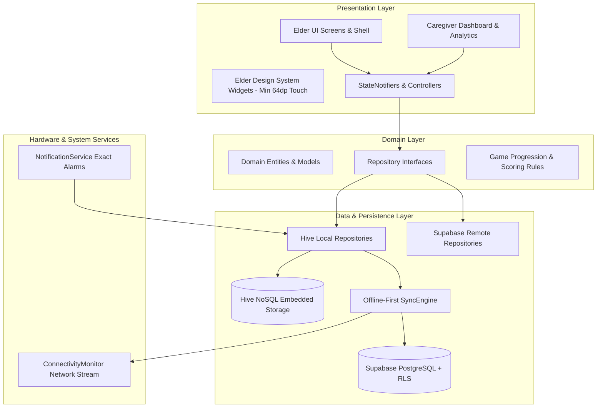
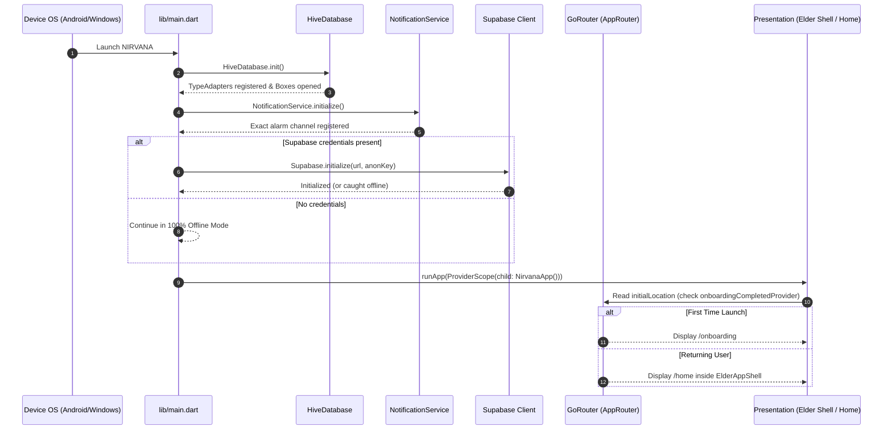
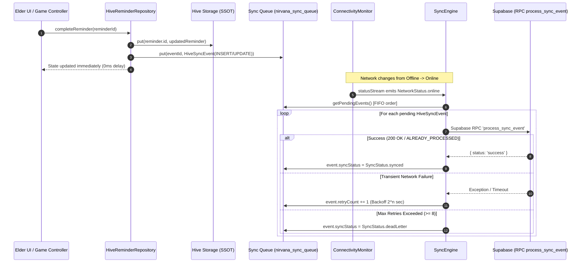
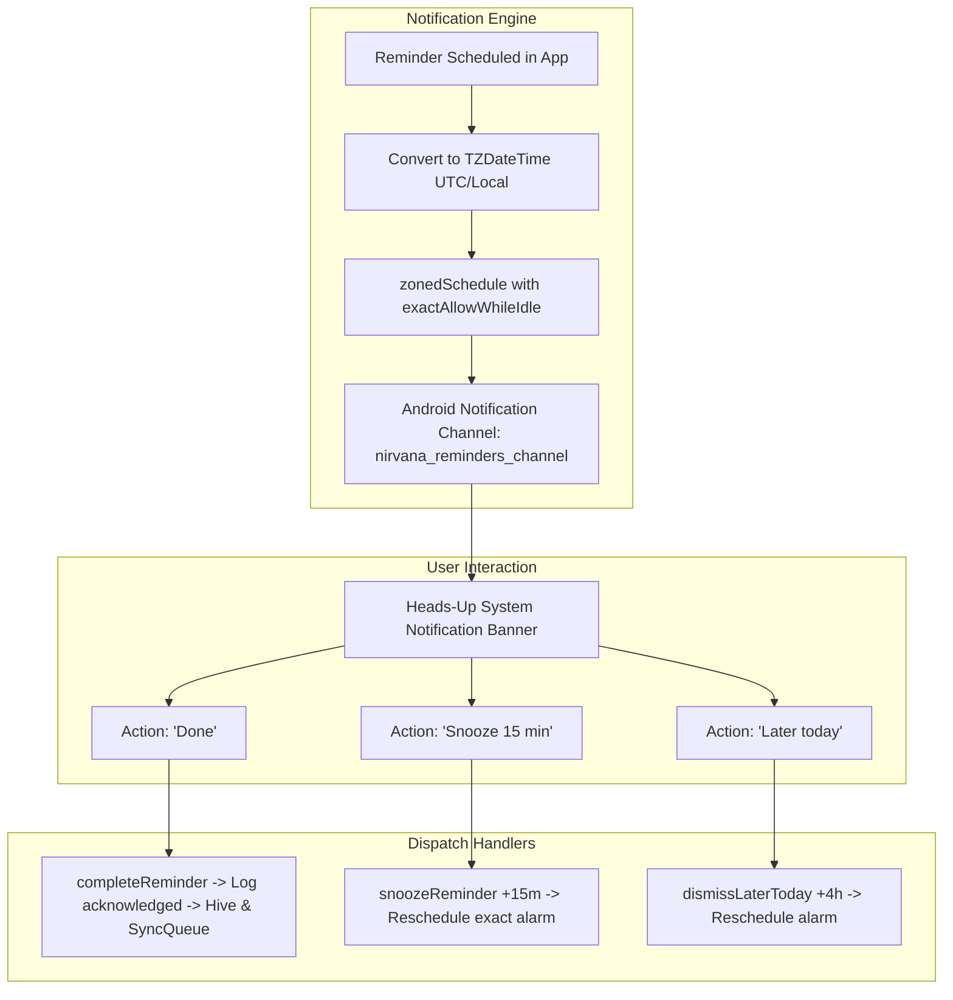
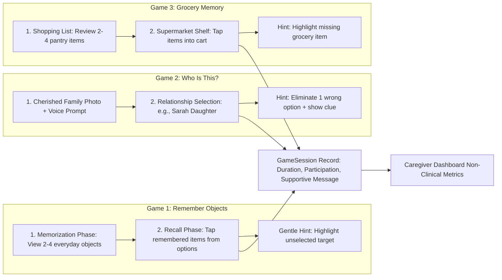
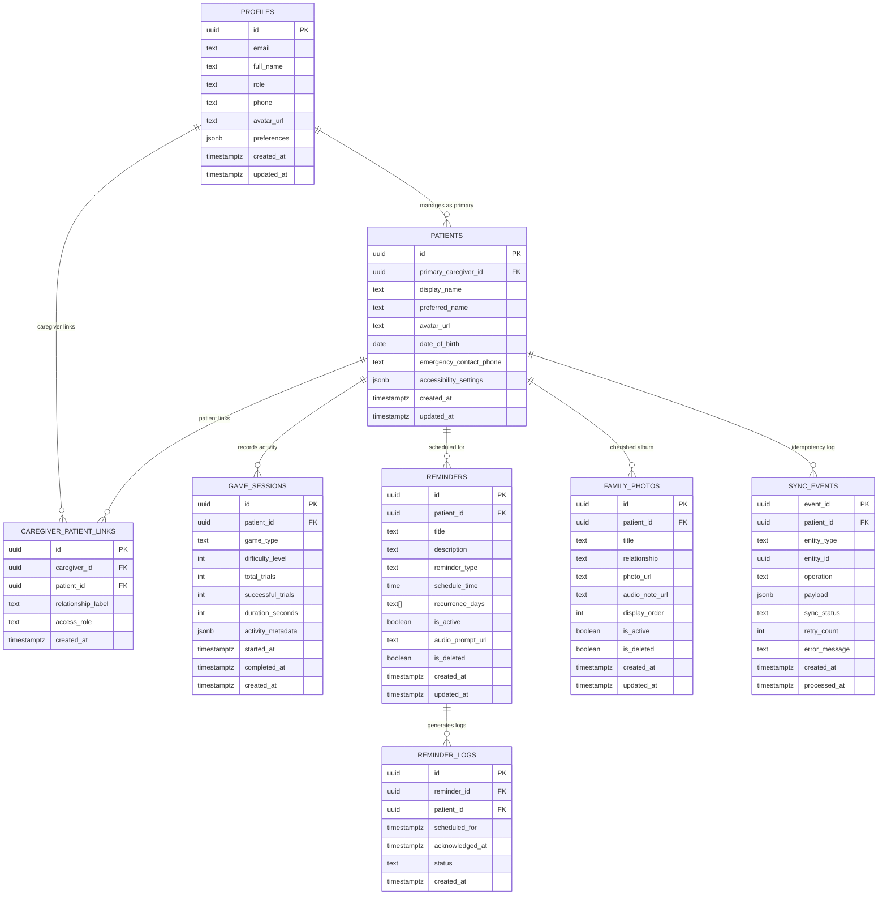

# NIRVANA - Comprehensive Project Architecture & Technical Documentation

---

## 1. Executive Summary & Core Philosophy

**NIRVANA** is an offline-first, mobile and desktop cross-platform application developed in Flutter/Dart, designed specifically to support elderly individuals, including those experiencing mild-to-moderate cognitive changes or dementia, while providing an integrated, secure monitoring dashboard for family caregivers.

### 1.1 Strict Ethical & Safety Mandates
1. **Non-Clinical Guarantee**: NIRVANA is strictly **non-diagnostic**. It does not diagnose dementia, compute "Brain Age", evaluate clinical disease staging, or prescribe medical treatments.
2. **Supportive Language & Positive Framing**: All engagement outputs are framed constructively (e.g., *"Wonderful Effort!"*, *"Activity Completed"*, *"Engaged 12 Minutes"*). Terms like *"Failed"*, *"Score: 30% (Poor)"*, or *"Cognitive Decline"* are strictly forbidden across the entire codebase and UI.
3. **Offline-First Sovereignty**: The core user experience—including daily medication reminders, local notifications, visual/memory engagement games, and user preferences—operates 100% autonomously without requiring an active internet connection.
4. **Biometric Privacy & Zero Third-Party AI Data Leakage**: No facial recognition, camera scanning, biometric identifiers, or Protected Health Information (PHI) are transmitted to external Large Language Models or third-party ad networks.

---

## 2. High-Level Architecture Overview

NIRVANA is engineered using **Clean Architecture Principles** combined with **Feature-Driven Modularization** and unidirectional reactive data flow powered by **Riverpod 2.x**.



### Architecture Layers:
1. **Presentation Layer (`lib/app/`, `lib/features/*/presentation`)**:
   - Declarative Flutter widgets customized for elder accessibility (high contrast, 64dp+ tap targets, 18sp+ typography, zero clutter).
   - Caregiver analytics widgets displaying non-clinical participation trends, reminder completion rates, and synchronization logs.
2. **Domain & Business Logic Layer (`lib/features/*/models`, `lib/features/*/controllers`, `lib/core/contracts`)**:
   - Pure Dart immutable models and state controllers.
   - Contains game state machines, hint generators, and supportive feedback logic.
3. **Data Layer (`lib/database/`, `lib/features/*/repositories`, `lib/core/network`)**:
   - **Local Tier (Single Source of Truth)**: Hive embedded NoSQL boxes for ultra-fast, synchronous local persistence.
   - **Cloud Tier**: Supabase PostgreSQL with strict Row Level Security (RLS) and idempotent transactional RPC ingestion.
4. **Platform Services Layer (`lib/features/reminders/services`, `lib/core/network`)**:
   - Exact alarm scheduling via `flutter_local_notifications` and timezone conversions.
   - Hardware network connectivity broadcasts via `connectivity_plus`.

---

## 3. Detailed File-by-File Architecture Breakdown

The NIRVANA codebase is organized into cleanly separated functional modules:

```
lib/
├── app/                  # Application bootstrap, routing, theming & design system
├── core/                 # Shared configs, network monitors, and synchronization engine
├── database/             # Hive NoSQL persistence, type adapters, and binary schemas
├── features/             # Feature slices (caregiver, games, home, onboarding, reminders, settings)
├── l10n/                 # Localization ARB files and generated delegates (EN, ES, HI)
└── main.dart             # Application entrypoint & dependency initialization
```

### 3.1 Application Root & Core Config

| File Path | Primary Responsibilities & Architectural Role | Key Functions / Classes / Providers |
|---|---|---|
| [`lib/main.dart`](file:///c:/PROJECT/S_I_H/lib/main.dart) | Application entrypoint. Initializes Flutter bindings, starts Hive NoSQL database, initializes local notifications with exact alarm permissions, conditionally boots Supabase client if keys are present, and wraps the app in a Riverpod `ProviderScope`. | `main()`, `NirvanaApp` (`ConsumerWidget`) |
| [`lib/core/config/supabase_config.dart`](file:///c:/PROJECT/S_I_H/lib/core/config/supabase_config.dart) | Centralized configuration for Supabase backend endpoints and public anonymous key (`anonKey`). Safely handles offline mode when keys are omitted. | `SupabaseConfig.supabaseUrl`, `SupabaseConfig.supabaseAnonKey`, `SupabaseConfig.isConfigured` |
| [`lib/core/contracts/supabase_repository_contracts.dart`](file:///c:/PROJECT/S_I_H/lib/core/contracts/supabase_repository_contracts.dart) | Abstract interface contracts defining cloud synchronization operations, caregiver repository functions, and network connectivity monitors. | `ISupabaseSyncRepository`, `ICaregiverRepository`, `IConnectivityMonitor`, `NetworkStatus` enum |
| [`lib/core/network/connectivity_monitor.dart`](file:///c:/PROJECT/S_I_H/lib/core/network/connectivity_monitor.dart) | Hardware network listener wrapping `connectivity_plus`. Emits a continuous reactive stream of `NetworkStatus.online` or `NetworkStatus.offline` to trigger sync workers. | `ConnectivityMonitor`, `connectivityMonitorProvider` |
| [`lib/core/network/sync_engine.dart`](file:///c:/PROJECT/S_I_H/lib/core/network/sync_engine.dart) | Core synchronization engine. Reads queued `HiveSyncEvent` mutations from Hive, sorts them chronologically (FIFO), monitors network state, executes idempotent RPC calls to Supabase, implements exponential backoff retry algorithms, and moves failed items to dead-letter status. | `SyncEngine`, `SyncResult`, `syncEngineProvider`, `syncRepositoryProvider` |
| [`lib/core/network/supabase_sync_repository.dart`](file:///c:/PROJECT/S_I_H/lib/core/network/supabase_sync_repository.dart) | Implements `ISupabaseSyncRepository`. Directly invokes Supabase RPC stored procedure `process_sync_event` passing serialized mutation payloads. | `SupabaseSyncRepository.processSyncEvent()` |

---

### 3.2 Application Shell, Routing & Accessibility Design System

| File Path | Primary Responsibilities & Architectural Role | Key Functions / Classes / Providers |
|---|---|---|
| [`lib/app/router/app_router.dart`](file:///c:/PROJECT/S_I_H/lib/app/router/app_router.dart) | Declarative navigation router configured with `GoRouter`. Sets up full-screen routes (`/onboarding`, `/caregiver/login`, `/caregiver/dashboard`) and a persistent `StatefulShellRoute.indexedStack` for elder navigation tabs (`/home`, `/games`, `/settings`). | `appRouterProvider`, `_rootNavigatorKey`, `_homeNavigatorKey`, `_gamesNavigatorKey`, `_settingsNavigatorKey` |
| [`lib/app/shell/elder_app_shell.dart`](file:///c:/PROJECT/S_I_H/lib/app/shell/elder_app_shell.dart) | Main scaffold wrapper providing an accessible bottom navigation bar with large high-contrast icons, 64dp+ tap targets, clear text labels, and active tab indicators. | `ElderAppShell` |
| [`lib/app/theme/elder_theme.dart`](file:///c:/PROJECT/S_I_H/lib/app/theme/elder_theme.dart) | Defines WCAG AAA compliant color palettes, semantic high-contrast tokens, surface elevations, and accessible theme builders (`buildStandardTheme`, `buildHighContrastTheme`). | `ElderColors`, `ElderTheme` |
| [`lib/app/theme/elder_typography.dart`](file:///c:/PROJECT/S_I_H/lib/app/theme/elder_typography.dart) | Typography scale specifically designed for visual impairment and cognitive clarity (minimum 18sp body text, 24sp-36sp headlines, generous letter spacing and line heights). | `ElderTypography.buildTextTheme()` |
| [`lib/app/providers/accessibility_providers.dart`](file:///c:/PROJECT/S_I_H/lib/app/providers/accessibility_providers.dart) | Riverpod state notifiers managing visual comfort settings: text scaling factor (`textScaleProvider`), high-contrast mode toggle (`highContrastProvider`), and active app language locale (`localeProvider`). | `TextScaleOption`, `TextScaleNotifier`, `HighContrastNotifier`, `LocaleNotifier` |
| [`lib/app/widgets/elder_card.dart`](file:///c:/PROJECT/S_I_H/lib/app/widgets/elder_card.dart) | Elevated accessible container with rounded corners, distinct borders, and high contrast for chunking information visually. | `ElderCard` |
| [`lib/app/widgets/large_action_button.dart`](file:///c:/PROJECT/S_I_H/lib/app/widgets/large_action_button.dart) | Tactile, oversized action button with minimum 64dp height, bold icon, and high-contrast color scheme for elder usability. | `LargeActionButton`, `LargeActionButtonVariant` |
| [`lib/app/widgets/large_icon_button.dart`](file:///c:/PROJECT/S_I_H/lib/app/widgets/large_icon_button.dart) | Large touch-target icon button with haptic-ready dimensions. | `LargeIconButton` |
| [`lib/app/widgets/section_header.dart`](file:///c:/PROJECT/S_I_H/lib/app/widgets/section_header.dart) | Accessible header component providing visual rhythm across screens. | `SectionHeader` |
| [`lib/app/widgets/supportive_message.dart`](file:///c:/PROJECT/S_I_H/lib/app/widgets/supportive_message.dart) | Reassuring prompt banner rendering gentle, non-stressful instructions or feedback. | `SupportiveMessage` |
| [`lib/app/widgets/loading_state.dart`](file:///c:/PROJECT/S_I_H/lib/app/widgets/loading_state.dart) | High-visibility loading spinner with descriptive text. | `LoadingState` |
| [`lib/app/widgets/error_state.dart`](file:///c:/PROJECT/S_I_H/lib/app/widgets/error_state.dart) | Friendly error state widget with retry action. | `ErrorState` |
| [`lib/app/widgets/empty_state.dart`](file:///c:/PROJECT/S_I_H/lib/app/widgets/empty_state.dart) | Supportive placeholder for lists with no items. | `EmptyState` |

---

### 3.3 Database & Local Persistence Layer (Hive NoSQL)

| File Path | Primary Responsibilities & Architectural Role | Key Functions / Classes / Providers |
|---|---|---|
| [`lib/database/hive_database.dart`](file:///c:/PROJECT/S_I_H/lib/database/hive_database.dart) | Hive initialization manager. Registers binary `TypeAdapters` and opens standard typed boxes (`nirvana_reminders`, `nirvana_reminder_logs`, `nirvana_sync_queue`). | `HiveDatabase.init()`, `registerAdapters()`, `openBoxes()`, `remindersBox`, `syncQueueBox` |
| [`lib/database/hive_boxes.dart`](file:///c:/PROJECT/S_I_H/lib/database/hive_boxes.dart) | Constant string identifiers for Hive box names and unique integer type IDs for serialization. | `HiveBoxes.reminders`, `HiveBoxes.syncQueue`, `HiveTypeIds` |
| [`lib/database/adapters/hive_adapters.dart`](file:///c:/PROJECT/S_I_H/lib/database/adapters/hive_adapters.dart) | Custom binary readers and writers for converting Hive objects to/from disk bytes. | `HiveSyncEventAdapter`, `HiveReminderAdapter`, `HiveReminderLogAdapter` |
| [`lib/database/models/hive_reminder.dart`](file:///c:/PROJECT/S_I_H/lib/database/models/hive_reminder.dart) | Hive NoSQL persistence model for reminder definitions (title, scheduled time, recurrence days, type, isCompleted, snoozedUntil). Converts seamlessly to/from domain `Reminder`. | `HiveReminder`, `fromDomain()`, `toDomain()` |
| [`lib/database/models/hive_reminder_log.dart`](file:///c:/PROJECT/S_I_H/lib/database/models/hive_reminder_log.dart) | Hive NoSQL model for logged reminder acknowledgements. | `HiveReminderLog`, `fromDomain()`, `toDomain()` |
| [`lib/database/models/hive_sync_event.dart`](file:///c:/PROJECT/S_I_H/lib/database/models/hive_sync_event.dart) | Local journal model representing pending mutations (insert, update, delete) awaiting cloud synchronization. | `HiveSyncEvent`, `SyncStatus` enum |

---

### 3.4 Reminders & Notifications Feature

| File Path | Primary Responsibilities & Architectural Role | Key Functions / Classes / Providers |
|---|---|---|
| [`lib/features/reminders/models/reminder.dart`](file:///c:/PROJECT/S_I_H/lib/features/reminders/models/reminder.dart) | Pure domain model for reminders (medication, hydration, meals, activities). | `Reminder`, `ReminderType` enum |
| [`lib/features/reminders/models/reminder_action.dart`](file:///c:/PROJECT/S_I_H/lib/features/reminders/models/reminder_action.dart) | Notification action payload identifiers (Done, Snooze 15 Min, Later Today). | `NotificationActionIds`, `ReminderActionType` |
| [`lib/features/reminders/models/reminder_log.dart`](file:///c:/PROJECT/S_I_H/lib/features/reminders/models/reminder_log.dart) | Domain model recording reminder compliance and response timestamps. | `ReminderLog`, `ReminderLogStatus` enum |
| [`lib/features/reminders/repositories/reminder_repository.dart`](file:///c:/PROJECT/S_I_H/lib/features/reminders/repositories/reminder_repository.dart) | Abstract interface defining all reminder persistence queries and mutations. | `IReminderRepository` |
| [`lib/features/reminders/repositories/hive_reminder_repository.dart`](file:///c:/PROJECT/S_I_H/lib/features/reminders/repositories/hive_reminder_repository.dart) | Concrete implementation of `IReminderRepository`. Writes directly to Hive local storage, automatically formulates `HiveSyncEvent` mutations, enqueues them in `syncQueueBox`, and triggers `SyncEngine`. | `HiveReminderRepository`, `saveReminder()`, `completeReminder()`, `snoozeReminder()` |
| [`lib/features/reminders/services/notification_service.dart`](file:///c:/PROJECT/S_I_H/lib/features/reminders/services/notification_service.dart) | Platform local notifications manager. Uses `flutter_local_notifications` and `timezone` for offline exact alarm scheduling (`AndroidScheduleMode.exactAllowWhileIdle`). Attaches interactive action buttons (`Done`, `Snooze 15 min`, `Later today`) and dispatches foreground/background responses. | `NotificationService`, `scheduleReminder()`, `cancelReminder()`, `handleNotificationResponse()`, `notificationTapBackground()` |
| [`lib/features/reminders/providers/reminder_providers.dart`](file:///c:/PROJECT/S_I_H/lib/features/reminders/providers/reminder_providers.dart) | Riverpod providers connecting the presentation layer to the reminder repository, active reminder lists, and reminder action handlers. | `reminderRepositoryProvider`, `activeRemindersProvider`, `remindersControllerProvider` |

---

### 3.5 Cognitive Engagement Games Feature

| File Path | Primary Responsibilities & Architectural Role | Key Functions / Classes / Providers |
|---|---|---|
| [`lib/features/games/models/game_enums.dart`](file:///c:/PROJECT/S_I_H/lib/features/games/models/game_enums.dart) | Enums defining game categories (`rememberObjects`, `whoIsThis`, `groceryMemory`) and difficulty tiers (`easy`, `medium`, `hard`) with configuration extensions. | `GameType`, `GameDifficulty` |
| [`lib/features/games/models/game_item.dart`](file:///c:/PROJECT/S_I_H/lib/features/games/models/game_item.dart) | Domain model for items used in visual recognition and grocery games (emoji, name, image asset path, category). Includes built-in catalogues. | `GameItem`, `defaultEverydayItems`, `defaultGroceryItems` |
| [`lib/features/games/models/family_member_item.dart`](file:///c:/PROJECT/S_I_H/lib/features/games/models/family_member_item.dart) | Model representing cherished family members for the *"Who Is This?"* game (photo URL/asset, name, relationship, voice prompt URL, hint description, distractors). | `FamilyMemberItem`, `defaultFamilyMembers` |
| [`lib/features/games/models/game_session.dart`](file:///c:/PROJECT/S_I_H/lib/features/games/models/game_session.dart) | Immutable session completion entity recording duration, correct answers, hints used, and non-clinical encouraging summaries. | `GameSession`, `supportiveFeedbackMessage` |
| [`lib/features/games/controllers/remember_objects_controller.dart`](file:///c:/PROJECT/S_I_H/lib/features/games/controllers/remember_objects_controller.dart) | State machine for Game 1 (*Remember Objects*). Manages the 2-step flow: Memorization phase $\rightarrow$ Recall selection grid, non-penalizing hints, and session generation. | `RememberObjectsController`, `RememberObjectsState` |
| [`lib/features/games/controllers/who_is_this_controller.dart`](file:///c:/PROJECT/S_I_H/lib/features/games/controllers/who_is_this_controller.dart) | State machine for Game 2 (*Who Is This?*). Manages family photo presentation, question progression, supportive hint elimination of distractors, and score formulation. | `WhoIsThisController`, `WhoIsThisState` |
| [`lib/features/games/controllers/grocery_memory_controller.dart`](file:///c:/PROJECT/S_I_H/lib/features/games/controllers/grocery_memory_controller.dart) | State machine for Game 3 (*Grocery Memory*). Manages shopping list review phase $\rightarrow$ supermarket shelf picking phase, cart toggle, and hint assistance. | `GroceryMemoryController`, `GroceryMemoryState` |
| [`lib/features/games/presentation/games_hub_screen.dart`](file:///c:/PROJECT/S_I_H/lib/features/games/presentation/games_hub_screen.dart) | Main hub displaying the 3 game cards with large touch targets, difficulty selectors, and calming audio/visual aesthetics. | `GamesHubScreen` |
| [`lib/features/games/presentation/remember_objects/remember_objects_screen.dart`](file:///c:/PROJECT/S_I_H/lib/features/games/presentation/remember_objects/remember_objects_screen.dart) | UI for Game 1 with large object cards, observation timer, and recall grid. | `RememberObjectsScreen` |
| [`lib/features/games/presentation/who_is_this/who_is_this_screen.dart`](file:///c:/PROJECT/S_I_H/lib/features/games/presentation/who_is_this/who_is_this_screen.dart) | UI for Game 2 with high-resolution photo display, relationship buttons, and hint modal. | `WhoIsThisScreen` |
| [`lib/features/games/presentation/grocery_memory/grocery_memory_screen.dart`](file:///c:/PROJECT/S_I_H/lib/features/games/presentation/grocery_memory/grocery_memory_screen.dart) | UI for Game 3 with shopping list card and supermarket shelf grid. | `GroceryMemoryScreen` |
| [`lib/features/games/presentation/widgets/elder_game_card.dart`](file:///c:/PROJECT/S_I_H/lib/features/games/presentation/widgets/elder_game_card.dart) | Reusable visual card for game selection. | `ElderGameCard` |
| [`lib/features/games/presentation/widgets/elder_game_button.dart`](file:///c:/PROJECT/S_I_H/lib/features/games/presentation/widgets/elder_game_button.dart) | Tactile button component optimized for game interactions. | `ElderGameButton` |
| [`lib/features/games/presentation/widgets/game_header.dart`](file:///c:/PROJECT/S_I_H/lib/features/games/presentation/widgets/game_header.dart) | Non-stressful header with game title, difficulty indicator, and exit button. | `GameHeader` |
| [`lib/features/games/presentation/widgets/game_completion_dialog.dart`](file:///c:/PROJECT/S_I_H/lib/features/games/presentation/widgets/game_completion_dialog.dart) | Celebratory dialog with confetti animations and encouraging feedback upon finishing an activity. | `GameCompletionDialog` |

---

### 3.6 Caregiver Dashboard & Portal Feature

| File Path | Primary Responsibilities & Architectural Role | Key Functions / Classes / Providers |
|---|---|---|
| [`lib/features/caregiver/models/caregiver_models.dart`](file:///c:/PROJECT/S_I_H/lib/features/caregiver/models/caregiver_models.dart) | Models for caregiver dashboard telemetry (`PatientSummary`, `CaregiverProfile`, `ActivitySessionSummary`, `ReminderStatusSummary`, `SyncQueueStatus`). | `PatientSummary`, `ActivitySessionSummary`, `ReminderStatusSummary` |
| [`lib/features/caregiver/repositories/caregiver_repository.dart`](file:///c:/PROJECT/S_I_H/lib/features/caregiver/repositories/caregiver_repository.dart) | Abstract interface for querying patient engagement summaries and synchronizing caregiver settings. | `ICaregiverRepository` |
| [`lib/features/caregiver/repositories/supabase_caregiver_repository.dart`](file:///c:/PROJECT/S_I_H/lib/features/caregiver/repositories/supabase_caregiver_repository.dart) | Supabase-backed implementation querying linked patient records, 7-day activity metrics, and reminder logs using authenticated RLS. | `SupabaseCaregiverRepository` |
| [`lib/features/caregiver/providers/caregiver_providers.dart`](file:///c:/PROJECT/S_I_H/lib/features/caregiver/providers/caregiver_providers.dart) | Riverpod providers supplying patient lists, 7-day participation summaries, reminder compliance data, and sync queue status to the caregiver UI. | `caregiverRepositoryProvider`, `selectedPatientProvider`, `patientSummaryProvider`, `sevenDayActivityProvider` |
| [`lib/features/caregiver/presentation/caregiver_login_screen.dart`](file:///c:/PROJECT/S_I_H/lib/features/caregiver/presentation/caregiver_login_screen.dart) | Secure authentication portal for caregivers with email/password and Supabase Auth integration. | `CaregiverLoginScreen` |
| [`lib/features/caregiver/presentation/caregiver_dashboard_screen.dart`](file:///c:/PROJECT/S_I_H/lib/features/caregiver/presentation/caregiver_dashboard_screen.dart) | Comprehensive analytics dashboard displaying patient switcher, engagement metrics, 7-day chart, recent game history, and sync health. | `CaregiverDashboardScreen` |
| [`lib/features/caregiver/presentation/widgets/patient_selector_widget.dart`](file:///c:/PROJECT/S_I_H/lib/features/caregiver/presentation/widgets/patient_selector_widget.dart) | Dropdown allowing caregivers managing multiple care recipients to switch active views. | `PatientSelectorWidget` |
| [`lib/features/caregiver/presentation/widgets/activity_summary_cards.dart`](file:///c:/PROJECT/S_I_H/lib/features/caregiver/presentation/widgets/activity_summary_cards.dart) | Cards displaying participation streaks, total engaged minutes, and preferred games. | `ActivitySummaryCards` |
| [`lib/features/caregiver/presentation/widgets/seven_day_activity_chart.dart`](file:///c:/PROJECT/S_I_H/lib/features/caregiver/presentation/widgets/seven_day_activity_chart.dart) | Visual bar chart displaying daily minutes of cognitive engagement over the past week. | `SevenDayActivityChart` |
| [`lib/features/caregiver/presentation/widgets/reminder_status_list.dart`](file:///c:/PROJECT/S_I_H/lib/features/caregiver/presentation/widgets/reminder_status_list.dart) | List showing daily reminder acknowledgement status (Done, Snoozed, Pending). | `ReminderStatusList` |
| [`lib/features/caregiver/presentation/widgets/game_history_list.dart`](file:///c:/PROJECT/S_I_H/lib/features/caregiver/presentation/widgets/game_history_list.dart) | Historical feed of completed activities with date, duration, and supportive results. | `GameHistoryList` |
| [`lib/features/caregiver/presentation/widgets/sync_status_card.dart`](file:///c:/PROJECT/S_I_H/lib/features/caregiver/presentation/widgets/sync_status_card.dart) | Status card displaying pending sync queue items, last sync timestamp, and network connectivity state. | `SyncStatusCard` |

---

### 3.7 Home, Onboarding, Settings & Localization

| File Path | Primary Responsibilities & Architectural Role | Key Functions / Classes / Providers |
|---|---|---|
| [`lib/features/home/presentation/home_screen.dart`](file:///c:/PROJECT/S_I_H/lib/features/home/presentation/home_screen.dart) | Peaceful, uncluttered home screen for elderly users. Features time-appropriate greeting (*"Good Morning"*, *"Good Afternoon"*), supportive reminder banner, 2 primary action cards (*"Today's Activities"* and *"App Settings & Comfort"*), and caregiver portal link. | `HomeScreen` |
| [`lib/features/onboarding/presentation/onboarding_screen.dart`](file:///c:/PROJECT/S_I_H/lib/features/onboarding/presentation/onboarding_screen.dart) | Welcoming first-run experience guiding the user through text size selection, high contrast preferences, and audio assistance. | `OnboardingScreen` |
| [`lib/features/onboarding/providers/onboarding_provider.dart`](file:///c:/PROJECT/S_I_H/lib/features/onboarding/providers/onboarding_provider.dart) | Manages onboarding state and persists completion flag to Hive settings box. | `onboardingCompletedProvider`, `OnboardingNotifier` |
| [`lib/features/settings/presentation/settings_screen.dart`](file:///c:/PROJECT/S_I_H/lib/features/settings/presentation/settings_screen.dart) | Visual comfort panel allowing elder users or caregivers to adjust font size, toggle high-contrast mode, configure audio cues, and switch language. | `SettingsScreen` |
| [`lib/features/settings/presentation/language_selector_screen.dart`](file:///c:/PROJECT/S_I_H/lib/features/settings/presentation/language_selector_screen.dart) | Dedicated language selection screen supporting English, Spanish (Español), and Hindi (हिन्दी). | `LanguageSelectorScreen` |
| [`lib/l10n/app_en.arb`](file:///c:/PROJECT/S_I_H/lib/l10n/app_en.arb), [`app_es.arb`](file:///c:/PROJECT/S_I_H/lib/l10n/app_es.arb), [`app_hi.arb`](file:///c:/PROJECT/S_I_H/lib/l10n/app_hi.arb) | Application Resource Bundle localization strings for multi-lingual accessibility. | English, Spanish, and Hindi translation dictionaries |

---

## 4. End-to-End Program Flow & Execution Lifecycle



### Execution Step-by-Step:
1. **Bootstrap Initialization**:
   - `WidgetsFlutterBinding.ensureInitialized()` ensures Flutter platform channels are ready.
   - `HiveDatabase.init()` creates/opens local binary storage for offline data (`nirvana_reminders`, `nirvana_reminder_logs`, `nirvana_sync_queue`).
   - `NotificationService.initialize()` configures Android notification channels (`nirvana_reminders_channel`), requests `SCHEDULE_EXACT_ALARM` permissions on Android 13+, and binds background tap callbacks.
   - `Supabase.initialize()` is executed with a safety timeout (5 seconds); if the network is down or credentials are empty, the app logs a graceful warning and proceeds in **100% Offline Mode**.
2. **Reactive UI Rendering**:
   - `NirvanaApp` (`ConsumerWidget`) watches `highContrastProvider`, `textScaleProvider`, and `localeProvider`.
   - When the user changes font size or toggles high contrast in Settings, the entire theme tree rebuilds smoothly and instantaneously across all active screens.
3. **Navigation & Tab Shell**:
   - `appRouterProvider` inspects `onboardingCompletedProvider`. If false, the user lands on `/onboarding`; otherwise, the user lands on `/home`.
   - `ElderAppShell` hosts an `IndexedStack` preserving state across Home (`/home`), Games (`/games`), and Settings (`/settings`).

---

## 5. Offline-First Local Storage & Synchronization Engine



### 5.1 Dual-Persistence Storage Strategy
1. **Local Single Source of Truth (SSOT)**:
   - All mutations (creating a reminder, ticking medication as taken, completing a game activity) are written **directly and synchronously to Hive NoSQL boxes**.
   - The UI never waits for network handshakes or cloud responses.
2. **Immutable Sync Queue (`nirvana_sync_queue`)**:
   - For every mutation, a `HiveSyncEvent` record is generated with a unique UUID v4 (`eventId`), target entity details, mutation type (`INSERT`, `UPDATE`, `DELETE`), and the serialized entity payload.
   - The event status begins as `SyncStatus.pending`.

### 5.2 Conflict Resolution & Resilience Rules
- **Idempotency via UUID v4**: Every mutation has an immutable `eventId`. If a mobile device re-sends an event due to a network timeout, Supabase detects the primary key in `public.sync_events` and returns `IGNORED_DUPLICATE` without double-applying data.
- **Last-Write-Wins (LWW)**: Entities containing mutable state (like reminders) utilize `updated_at` timestamps. Newer timestamps overwrite older records.
- **Append-Only Logs**: `game_sessions` and `reminder_logs` are append-only time series records that never conflict.
- **Exponential Backoff**: If an upload fails, `SyncEngine` computes retry delays via $T_{delay} = \min(2^{\text{retry\_count}}, 60\text{ seconds})$.
- **Dead-Letter Safeguard**: After 8 consecutive failures, the event transitions to `SyncStatus.deadLetter` to prevent queue poisoning.

---

## 6. Notification System Architecture



### Key Technical Aspects of Notifications:
1. **Platform Compatibility & Offline Exact Alarms**:
   - Utilizes `flutter_local_notifications` and `timezone/timezone.dart`.
   - On Android devices, reminders use `AndroidScheduleMode.exactAllowWhileIdle`, guaranteeing alarms fire accurately even when the device is in deep battery-saving Doze mode.
   - Graceful runtime fallback: If executed on unsupported desktop or web platforms, notifications fail silently without crashing the UI.
2. **Interactive Notification Action Buttons**:
   - **`Done`** (`NotificationActionIds.done`): Marks the reminder completed in local Hive, records a `ReminderLog` with status `acknowledged`, and synchronizes to the cloud.
   - **`Snooze 15 min`** (`NotificationActionIds.snooze15`): Postpones the alarm by 15 minutes, updates `snoozedUntil` in Hive, and schedules a new exact alarm.
   - **`Later today`** (`NotificationActionIds.laterToday`): Reschedules the reminder for 4 hours later in the day.
3. **Background & Foreground Dispatching**:
   - Foreground taps are processed by `handleNotificationResponse()`.
   - Background taps (when app is closed) are routed through `@pragma('vm:entry-point') void notificationTapBackground(NotificationResponse response)`.

---

## 7. The Three Cognitive Engagement Games

NIRVANA includes three gentle, scientifically inspired cognitive engagement activities designed specifically for elder accessibility and positive reinforcement:



---

### 7.1 Game 1: Remember Objects (Visual Recognition & Working Memory)
- **Controller**: [`lib/features/games/controllers/remember_objects_controller.dart`](file:///c:/PROJECT/S_I_H/lib/features/games/controllers/remember_objects_controller.dart)
- **Screen**: [`lib/features/games/presentation/remember_objects/remember_objects_screen.dart`](file:///c:/PROJECT/S_I_H/lib/features/games/presentation/remember_objects/remember_objects_screen.dart)
- **Mechanics**:
  1. **Memorization Phase**: Displays a set of everyday household objects (e.g., Apple 🍎, Key 🔑, Cup ☕, Book 📖, Glasses 👓) with high-contrast icons and subtitles. The user can take as much time as they wish (no countdown pressure).
  2. **Recall Phase**: The user taps *"I'm Ready"* to transition to a selection grid containing the targets plus distractors.
  3. **Adaptive Difficulty**:
     - *Easy*: 2 items to remember out of 4 options.
     - *Medium*: 3 items to remember out of 6 options.
     - *Hard*: 4 items to remember out of 8 options.
  4. **Supportive Hint**: Tapping *"Hint"* highlights an unselected target item with gentle feedback (*"Take a look at the Key!"*).

---

### 7.2 Game 2: Who Is This? (Familiar Face & Family Recall)
- **Controller**: [`lib/features/games/controllers/who_is_this_controller.dart`](file:///c:/PROJECT/S_I_H/lib/features/games/controllers/who_is_this_controller.dart)
- **Screen**: [`lib/features/games/presentation/who_is_this/who_is_this_screen.dart`](file:///c:/PROJECT/S_I_H/lib/features/games/presentation/who_is_this/who_is_this_screen.dart)
- **Mechanics**:
  1. **Cherished Photos**: Presents high-resolution photos of family members, caregivers, or cherished pets uploaded by caregivers.
  2. **Multi-Sensory Voice Prompt**: Optional audio voice note (e.g., *"Hi Grandpa, it's Emily!"*) to stimulate auditory and emotional recognition.
  3. **Multiple Choice**: Large buttons presenting relationship choices (e.g., *"Sarah (Daughter)"*, *"Emily (Granddaughter)"*).
  4. **Supportive Hint**: Tapping *"Hint"* reveals a personal story clue and eliminates one incorrect distractor without penalty.

---

### 7.3 Game 3: Grocery Memory (Sequencing & Everyday Domestic Routine)
- **Controller**: [`lib/features/games/controllers/grocery_memory_controller.dart`](file:///c:/PROJECT/S_I_H/lib/features/games/controllers/grocery_memory_controller.dart)
- **Screen**: [`lib/features/games/presentation/grocery_memory/grocery_memory_screen.dart`](file:///c:/PROJECT/S_I_H/lib/features/games/presentation/grocery_memory/grocery_memory_screen.dart)
- **Mechanics**:
  1. **Shopping List Phase**: Shows an everyday shopping list (e.g., Bread 🍞, Milk 🥛, Bananas 🍌).
  2. **Supermarket Shelf Phase**: The user visits the supermarket shelf and taps the list items to place them into their shopping cart.
  3. **Instant Tactile Feedback**: Selected items animate into the basket.
  4. **Supportive Hint**: Tapping *"Hint"* highlights a missing shopping item on the shelf (*"Look for the Bread 🍞 on the shelf!"*).

---

## 8. Database Schema & Table Specifications

The backend is built on **Supabase PostgreSQL** with comprehensive constraints, triggers, and Row Level Security (RLS) policies.



---

### 8.1 Detailed Table Schema Definitions

#### 1. `public.profiles`
Stores caregiver, family member, and administrator user metadata linked to Supabase Auth (`auth.users`).
```sql
CREATE TABLE IF NOT EXISTS public.profiles (
    id UUID PRIMARY KEY REFERENCES auth.users(id) ON DELETE CASCADE,
    email TEXT UNIQUE NOT NULL,
    full_name TEXT NOT NULL,
    role TEXT NOT NULL DEFAULT 'caregiver' CHECK (role IN ('caregiver', 'family_member', 'admin')),
    phone TEXT,
    avatar_url TEXT,
    preferences JSONB DEFAULT '{"theme": "system", "notifications_enabled": true, "email_alerts": true}'::jsonb NOT NULL,
    created_at TIMESTAMPTZ DEFAULT TIMEZONE('utc', NOW()) NOT NULL,
    updated_at TIMESTAMPTZ DEFAULT TIMEZONE('utc', NOW()) NOT NULL
);
```

#### 2. `public.patients`
Stores elderly user profiles, display names, emergency contacts, and accessibility settings.
```sql
CREATE TABLE IF NOT EXISTS public.patients (
    id UUID PRIMARY KEY DEFAULT gen_random_uuid(),
    primary_caregiver_id UUID REFERENCES public.profiles(id) ON DELETE SET NULL,
    display_name TEXT NOT NULL,
    preferred_name TEXT NOT NULL,
    avatar_url TEXT,
    date_of_birth DATE,
    emergency_contact_phone TEXT,
    accessibility_settings JSONB DEFAULT '{
        "large_text": true,
        "high_contrast": true,
        "audio_prompts": true,
        "haptic_feedback": true,
        "low_motion": true,
        "font_scale": 1.3
    }'::jsonb NOT NULL,
    created_at TIMESTAMPTZ DEFAULT TIMEZONE('utc', NOW()) NOT NULL,
    updated_at TIMESTAMPTZ DEFAULT TIMEZONE('utc', NOW()) NOT NULL
);
```

#### 3. `public.caregiver_patient_links`
Enables multi-caregiver collaboration and fine-grained access control.
```sql
CREATE TABLE IF NOT EXISTS public.caregiver_patient_links (
    id UUID PRIMARY KEY DEFAULT gen_random_uuid(),
    caregiver_id UUID NOT NULL REFERENCES public.profiles(id) ON DELETE CASCADE,
    patient_id UUID NOT NULL REFERENCES public.patients(id) ON DELETE CASCADE,
    relationship_label TEXT DEFAULT 'Caregiver' NOT NULL,
    access_role TEXT NOT NULL DEFAULT 'primary' CHECK (access_role IN ('primary', 'secondary', 'viewer')),
    created_at TIMESTAMPTZ DEFAULT TIMEZONE('utc', NOW()) NOT NULL,
    CONSTRAINT uq_caregiver_patient UNIQUE (caregiver_id, patient_id)
);
```

#### 4. `public.game_sessions`
Stores non-clinical engagement activity telemetry.
```sql
CREATE TABLE IF NOT EXISTS public.game_sessions (
    id UUID PRIMARY KEY DEFAULT gen_random_uuid(),
    patient_id UUID NOT NULL REFERENCES public.patients(id) ON DELETE CASCADE,
    game_type TEXT NOT NULL CHECK (game_type IN ('remember_objects', 'who_is_this', 'grocery_memory')),
    difficulty_level INT NOT NULL DEFAULT 1 CHECK (difficulty_level >= 1 AND difficulty_level <= 5),
    total_trials INT NOT NULL DEFAULT 0 CHECK (total_trials >= 0),
    successful_trials INT NOT NULL DEFAULT 0 CHECK (successful_trials >= 0),
    duration_seconds INT NOT NULL DEFAULT 0 CHECK (duration_seconds >= 0),
    activity_metadata JSONB DEFAULT '{}'::jsonb NOT NULL,
    started_at TIMESTAMPTZ NOT NULL,
    completed_at TIMESTAMPTZ NOT NULL,
    created_at TIMESTAMPTZ DEFAULT TIMEZONE('utc', NOW()) NOT NULL
);
```

#### 5. `public.reminders`
Configures medication, hydration, and daily routine alerts.
```sql
CREATE TABLE IF NOT EXISTS public.reminders (
    id UUID PRIMARY KEY DEFAULT gen_random_uuid(),
    patient_id UUID NOT NULL REFERENCES public.patients(id) ON DELETE CASCADE,
    title TEXT NOT NULL,
    description TEXT,
    reminder_type TEXT NOT NULL CHECK (reminder_type IN ('medication', 'hydration', 'meal', 'social', 'activity', 'general')),
    schedule_time TIME NOT NULL,
    recurrence_days TEXT[] DEFAULT ARRAY['mon','tue','wed','thu','fri','sat','sun'] NOT NULL,
    is_active BOOLEAN DEFAULT true NOT NULL,
    audio_prompt_url TEXT,
    is_deleted BOOLEAN DEFAULT false NOT NULL,
    created_at TIMESTAMPTZ DEFAULT TIMEZONE('utc', NOW()) NOT NULL,
    updated_at TIMESTAMPTZ DEFAULT TIMEZONE('utc', NOW()) NOT NULL
);
```

#### 6. `public.reminder_logs`
Tracks elder responses to scheduled reminders for caregiver compliance monitoring.
```sql
CREATE TABLE IF NOT EXISTS public.reminder_logs (
    id UUID PRIMARY KEY DEFAULT gen_random_uuid(),
    reminder_id UUID NOT NULL REFERENCES public.reminders(id) ON DELETE CASCADE,
    patient_id UUID NOT NULL REFERENCES public.patients(id) ON DELETE CASCADE,
    scheduled_for TIMESTAMPTZ NOT NULL,
    acknowledged_at TIMESTAMPTZ,
    status TEXT NOT NULL CHECK (status IN ('acknowledged', 'missed', 'snoozed')),
    created_at TIMESTAMPTZ DEFAULT TIMEZONE('utc', NOW()) NOT NULL
);
```

#### 7. `public.family_photos`
Stores cherished photo metadata and audio note links for the memory gallery and *"Who Is This?"* game.
```sql
CREATE TABLE IF NOT EXISTS public.family_photos (
    id UUID PRIMARY KEY DEFAULT gen_random_uuid(),
    patient_id UUID NOT NULL REFERENCES public.patients(id) ON DELETE CASCADE,
    title TEXT NOT NULL,
    relationship TEXT NOT NULL,
    photo_url TEXT NOT NULL,
    audio_note_url TEXT,
    display_order INT DEFAULT 0 NOT NULL,
    is_active BOOLEAN DEFAULT true NOT NULL,
    is_deleted BOOLEAN DEFAULT false NOT NULL,
    created_at TIMESTAMPTZ DEFAULT TIMEZONE('utc', NOW()) NOT NULL,
    updated_at TIMESTAMPTZ DEFAULT TIMEZONE('utc', NOW()) NOT NULL
);
```

#### 8. `public.sync_events`
Idempotency ledger recording all synchronized mutations from mobile devices.
```sql
CREATE TABLE IF NOT EXISTS public.sync_events (
    event_id UUID PRIMARY KEY,
    patient_id UUID NOT NULL REFERENCES public.patients(id) ON DELETE CASCADE,
    entity_type TEXT NOT NULL CHECK (entity_type IN ('game_session', 'reminder', 'reminder_log', 'family_photo', 'patient', 'profile')),
    entity_id UUID NOT NULL,
    operation TEXT NOT NULL CHECK (operation IN ('INSERT', 'UPDATE', 'DELETE')),
    payload JSONB NOT NULL,
    sync_status TEXT NOT NULL DEFAULT 'PROCESSED' CHECK (sync_status IN ('PROCESSED', 'FAILED', 'IGNORED_DUPLICATE')),
    retry_count INT DEFAULT 0 NOT NULL,
    error_message TEXT,
    created_at TIMESTAMPTZ NOT NULL,
    processed_at TIMESTAMPTZ DEFAULT TIMEZONE('utc', NOW()) NOT NULL
);
```

---

### 8.2 Row Level Security (RLS) & Security Functions
All tables have Row Level Security enabled. Access is validated using the security definer function `is_caregiver_for_patient()`:

```sql
CREATE OR REPLACE FUNCTION public.is_caregiver_for_patient(patient_uuid UUID)
RETURNS BOOLEAN AS $$
BEGIN
    RETURN EXISTS (
        SELECT 1 FROM public.caregiver_patient_links
        WHERE caregiver_id = auth.uid()
        AND patient_id = patient_uuid
    ) OR EXISTS (
        SELECT 1 FROM public.patients
        WHERE id = patient_uuid
        AND primary_caregiver_id = auth.uid()
    );
END;
$$ LANGUAGE plpgsql SECURITY DEFINER;
```

---

## 9. Summary & Quick Architecture Reference Matrix

| Feature Domain | Primary Tech Stack / Framework | Local Tier (Offline SSOT) | Cloud Tier (Remote) | Key Architecture Highlights |
|---|---|---|---|---|
| **App Architecture** | Flutter 3.8+ / Dart, Riverpod 2.6 | Memory / StateNotifiers | Supabase Realtime | Feature-first clean architecture with unidirectional state |
| **Elder Presentation** | Flutter Material / ElderTheme | UI State Cache | — | 64dp touch targets, AAA contrast, 18sp+ text, low motion |
| **Local Storage** | `hive_flutter`, `hive` | `nirvana_reminders`, `nirvana_reminder_logs`, `nirvana_sync_queue` | — | Zero-latency synchronous NoSQL binary storage |
| **Cloud Sync** | `connectivity_plus`, `supabase_flutter` | `box_sync_events` FIFO queue | `public.sync_events` RPC | Idempotent UUID v4 keys, exponential backoff, dead letter queue |
| **Notifications** | `flutter_local_notifications`, `timezone` | Exact alarm scheduling (`exactAllowWhileIdle`) | — | Interactive actions (`Done`, `Snooze`, `Later`), offline alarms |
| **Cognitive Games** | Pure Dart State Controllers | Hive Game Session Logs | `public.game_sessions` | 3 activities (*Remember Objects*, *Who Is This?*, *Grocery Memory*), non-clinical framing |
| **Caregiver Portal** | Flutter Riverpod + Supabase Auth | Cached Patient Telemetry | `public.profiles`, `public.patients`, RLS | 7-day engagement charts, reminder compliance, multi-patient switch |
| **Security & Privacy** | Supabase Row Level Security (RLS) | OS Sandboxed Documents Directory | PostgreSQL RLS + JWT | Zero third-party AI transmission, authenticated caregiver links |
| **Localization** | Flutter Localizations + ARB | AppLocale Provider | — | Multi-language support (English, Español, हिन्दी) |
