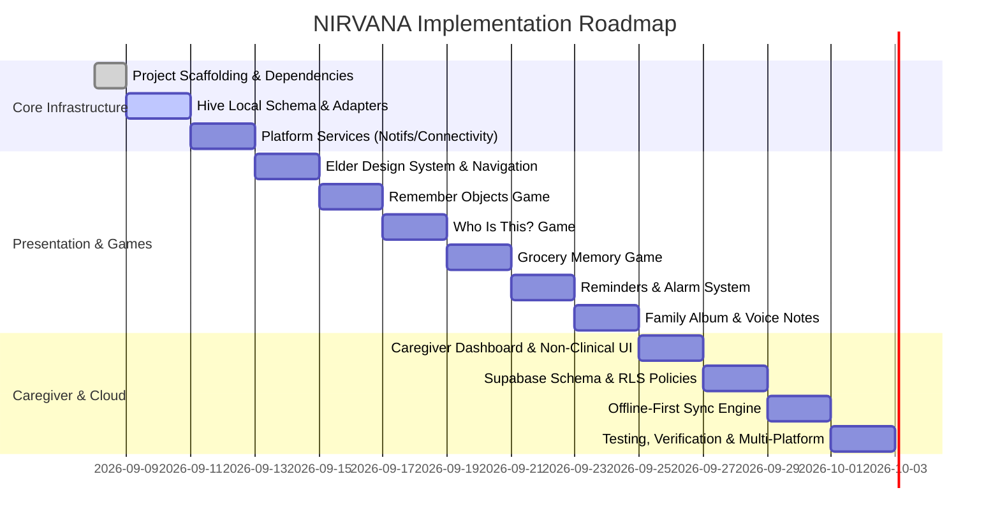

# NIRVANA - Implementation Roadmap & Milestones

---

## Milestone Breakdown

### Milestone 1: Foundation & Project Scaffolding
- Initialize Flutter project with support for Android and Windows.
- Configure `pubspec.yaml` with required dependencies and lock compatible versions.
- Setup folder structure following feature-first clean architecture.
- Setup Riverpod provider scopes and GoRouter configuration with mode guards.

### Milestone 2: Local Storage & Domain Layer
- Implement pure Dart domain entities and repository contracts.
- Implement Hive TypeAdapters and local data sources for:
  - `ProfileEntity`
  - `GameSessionEntity`
  - `ReminderEntity` & `ReminderLogEntity`
  - `FamilyPhotoEntity`
  - `SyncEventEntity`
- Build repository implementations guaranteeing local-first persistence.

### Milestone 3: Platform Services
- **ConnectivityService**: Real-time network listener.
- **NotificationService**: Offline exact alarms via `flutter_local_notifications` and timezone support.
- **AudioService**: Friendly chimes and voice note audio player.

### Milestone 4: Elder UI System & Navigation
- High-contrast color palette, custom accessible typography (Lexend/Plus Jakarta Sans).
- Elder-friendly components: `ElderButton` (minimum 64dp touch target), `ElderCard`, `ElderAppBar`, `SafeBanner`.
- Low-motion system and single-focus navigation paradigm.

### Milestone 5: Cognitive Engagement Games
- **Remember Objects**: Memorization card -> recall grid -> encouraging completion banner.
- **Who Is This?**: Family photo display -> audio cue -> large choice cards + hint option.
- **Grocery Memory**: Familiar shopping list -> interactive shelf picking into cart.
- Auto-persist session logs into Hive with non-clinical telemetry.

### Milestone 6: Daily Reminders & Family Album
- Elder reminder screen with large acknowledgment ("I took my medicine" / "I drank water").
- Family photo viewer with large navigation arrows and audio voice notes.

### Milestone 7: Caregiver Dashboard
- Role-gated dashboard for caregivers:
  - Patient overview and non-clinical engagement summary (days active, minutes spent, reminders met).
  - Reminder scheduler and manager.
  - Family photo uploader and relationship manager.

### Milestone 8: Supabase Integration & Offline Sync Engine
- Configure Supabase client (anon key).
- Implement `SyncEngine` worker that drains `box_sync_events` idempotently.
- Implement server DDL and RLS policies in Supabase SQL editor.

### Milestone 9: Quality Assurance & Multi-Platform Verification
- Static analysis: `flutter analyze` with zero warnings.
- Unit and widget tests for repositories, controllers, and game mechanics.
- Verification on Android and Windows platforms.
