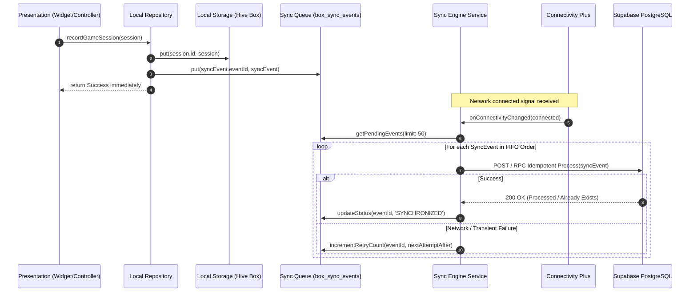

# NIRVANA - Offline-First Synchronization Engine Specification

## 1. Overview & Core Philosophy

NIRVANA is designed with an **Offline-First, Cloud-Synchronized** architecture. The application is completely autonomous:
1. Every write operation (completing a game, setting a reminder, logging medication intake, saving a family photo) is written **immediately to local Hive storage**.
2. A corresponding immutable **`SyncEvent`** is journaled into the local `box_sync_events`.
3. The UI state updates instantly without waiting for a server handshake or network acknowledgment.
4. When network connectivity is established or restored, the **SyncEngine** flushes pending events to Supabase asynchronously in FIFO/chronological order.



---

## 2. SyncEvent Data Structure

Every local mutation generates an immutable event with the following specification:

```dart
enum SyncOperation { insert, update, delete }
enum SyncStatus { pending, inProgress, synchronized, failed }

class SyncEvent {
  final String eventId;          // UUID v4 (Unique per event)
  final String patientId;        // Associated patient UUID
  final String entityType;       // 'game_session', 'reminder', 'reminder_log', 'family_photo'
  final String entityId;         // UUID of the entity being mutated
  final SyncOperation operation; // insert, update, delete
  final Map<String, dynamic> payload; // Complete serialized entity payload
  final SyncStatus syncStatus;   // pending, inProgress, synchronized, failed
  final int retryCount;          // Current attempt count (default 0)
  final String? errorMessage;    // Detailed error trace if failed
  final DateTime createdAt;      // Local timestamp when created
  final DateTime? processedAt;   // Timestamp when server accepted event
}
```

---

## 3. Idempotency Guarantees & Server Handling

### 3.1 Idempotent Ingestion Pattern
To prevent duplicate records or inconsistent states if an event payload is uploaded more than once (due to network timeout or client retransmission):
1. The server table `sync_events` holds a primary key on `event_id`.
2. When the sync payload is sent to Supabase, it is processed within an atomic PostgreSQL transaction / RPC:
   - If `event_id` already exists in `sync_events`, the server acknowledges the transaction with `status: 'IGNORED_DUPLICATE'` and returns success (HTTP 200).
   - If `event_id` is new, it applies the mutation using an `UPSERT` statement (`ON CONFLICT (id) DO UPDATE ...`) and records the `event_id` in `sync_events`.

### 3.2 Database Ingestion Function (RPC)

```sql
CREATE OR REPLACE FUNCTION public.process_sync_event(
    p_event_id UUID,
    p_patient_id UUID,
    p_entity_type TEXT,
    p_entity_id UUID,
    p_operation TEXT,
    p_payload JSONB,
    p_created_at TIMESTAMPTZ
) RETURNS JSONB AS $$
DECLARE
    v_existing_event RECORD;
BEGIN
    -- 1. Check if event was already processed (Idempotency Check)
    SELECT * INTO v_existing_event FROM public.sync_events WHERE event_id = p_event_id;
    IF FOUND THEN
        RETURN jsonb_build_object('status', 'ALREADY_PROCESSED', 'event_id', p_event_id);
    END IF;

    -- 2. Execute entity mutation according to type and operation
    IF p_entity_type = 'game_session' THEN
        INSERT INTO public.game_sessions (id, patient_id, game_type, difficulty_level, total_trials, successful_trials, duration_seconds, activity_metadata, started_at, completed_at, created_at)
        VALUES (
            p_entity_id,
            p_patient_id,
            p_payload->>'game_type',
            (p_payload->>'difficulty_level')::INT,
            (p_payload->>'total_trials')::INT,
            (p_payload->>'successful_trials')::INT,
            (p_payload->>'duration_seconds')::INT,
            p_payload->'activity_metadata',
            (p_payload->>'started_at')::TIMESTAMPTZ,
            (p_payload->>'completed_at')::TIMESTAMPTZ,
            p_created_at
        )
        ON CONFLICT (id) DO NOTHING;

    ELSIF p_entity_type = 'reminder' THEN
        IF p_operation = 'DELETE' THEN
            UPDATE public.reminders SET is_deleted = true, updated_at = NOW() WHERE id = p_entity_id;
        ELSE
            INSERT INTO public.reminders (id, patient_id, title, description, reminder_type, schedule_time, recurrence_days, is_active, audio_prompt_url, is_deleted, created_at, updated_at)
            VALUES (
                p_entity_id,
                p_patient_id,
                p_payload->>'title',
                p_payload->>'description',
                p_payload->>'reminder_type',
                (p_payload->>'schedule_time')::TIME,
                ARRAY(SELECT jsonb_array_elements_text(p_payload->'recurrence_days')),
                (p_payload->>'is_active')::BOOLEAN,
                p_payload->>'audio_prompt_url',
                COALESCE((p_payload->>'is_deleted')::BOOLEAN, false),
                p_created_at,
                NOW()
            )
            ON CONFLICT (id) DO UPDATE SET
                title = EXCLUDED.title,
                description = EXCLUDED.description,
                reminder_type = EXCLUDED.reminder_type,
                schedule_time = EXCLUDED.schedule_time,
                recurrence_days = EXCLUDED.recurrence_days,
                is_active = EXCLUDED.is_active,
                audio_prompt_url = EXCLUDED.audio_prompt_url,
                is_deleted = EXCLUDED.is_deleted,
                updated_at = NOW();
        END IF;

    ELSIF p_entity_type = 'reminder_log' THEN
        INSERT INTO public.reminder_logs (id, reminder_id, patient_id, scheduled_for, acknowledged_at, status, created_at)
        VALUES (
            p_entity_id,
            (p_payload->>'reminder_id')::UUID,
            p_patient_id,
            (p_payload->>'scheduled_for')::TIMESTAMPTZ,
            (p_payload->>'acknowledged_at')::TIMESTAMPTZ,
            p_payload->>'status',
            p_created_at
        )
        ON CONFLICT (id) DO NOTHING;

    ELSIF p_entity_type = 'family_photo' THEN
        IF p_operation = 'DELETE' THEN
            UPDATE public.family_photos SET is_deleted = true, updated_at = NOW() WHERE id = p_entity_id;
        ELSE
            INSERT INTO public.family_photos (id, patient_id, title, relationship, photo_url, audio_note_url, display_order, is_active, is_deleted, created_at, updated_at)
            VALUES (
                p_entity_id,
                p_patient_id,
                p_payload->>'title',
                p_payload->>'relationship',
                p_payload->>'photo_url',
                p_payload->>'audio_note_url',
                (p_payload->>'display_order')::INT,
                (p_payload->>'is_active')::BOOLEAN,
                COALESCE((p_payload->>'is_deleted')::BOOLEAN, false),
                p_created_at,
                NOW()
            )
            ON CONFLICT (id) DO UPDATE SET
                title = EXCLUDED.title,
                relationship = EXCLUDED.relationship,
                photo_url = EXCLUDED.photo_url,
                audio_note_url = EXCLUDED.audio_note_url,
                display_order = EXCLUDED.display_order,
                is_active = EXCLUDED.is_active,
                is_deleted = EXCLUDED.is_deleted,
                updated_at = NOW();
        END IF;
    END IF;

    -- 3. Record sync event in server log
    INSERT INTO public.sync_events (event_id, patient_id, entity_type, entity_id, operation, payload, sync_status, created_at, processed_at)
    VALUES (p_event_id, p_patient_id, p_entity_type, p_entity_id, p_operation, p_payload, 'PROCESSED', p_created_at, NOW());

    RETURN jsonb_build_object('status', 'SUCCESS', 'event_id', p_event_id);
END;
$$ LANGUAGE plpgsql SECURITY DEFINER;
```

---

## 4. Conflict Resolution Strategy

1. **Last-Write-Wins (LWW) with Timestamps**:
   - Entities like Reminders and Settings use `updated_at` timestamps. The record with the newer timestamp takes precedence during cloud merge.
2. **Soft Deletions (Tombstones)**:
   - Deletions are never physical `DELETE FROM` operations; instead, an `is_deleted = true` flag is set and synchronized. This prevents deleted items from resurrecting when an older client syncs.
3. **Append-Only Logs**:
   - `game_sessions` and `reminder_logs` are immutable historical events. Conflicts cannot occur because records are append-only.

---

## 5. Media & Photo Synchronization Pipeline

1. **Local Storage First**:
   - When a caregiver or user takes or selects a photo, the image file is compressed, resized to 1080p, and saved to the app's local sandbox: `${appDocsDir}/photos/${photoId}.jpg`.
   - The `FamilyPhoto` record is immediately added to Hive with `localCachePath`.
2. **Background Upload**:
   - Sync service uploads the file to Supabase Storage bucket `family-photos/${patientId}/${photoId}.jpg`.
   - Upon upload completion, the public/signed URL is attached to the payload and synchronized via the standard `SyncEvent` queue.
3. **Offline Fallback**:
   - The UI widget uses a custom `SafeFamilyImage` component that checks `localCachePath` first. If missing, it falls back to downloading `photoUrl` and caching it locally.

---

## 6. Resilience & Exponential Backoff

When network errors or server rate-limits occur:
- Delay formula: $T_{delay} = \min(2^{\text{retry\_count}} \times 1.5\text{ seconds}, 300\text{ seconds})$.
- Max immediate retries: 5 attempts before marking as `failed_pending_user_network`.
- Automatic retry resets as soon as `ConnectivityResult` transitions from `none` to `wifi` or `mobile`.
